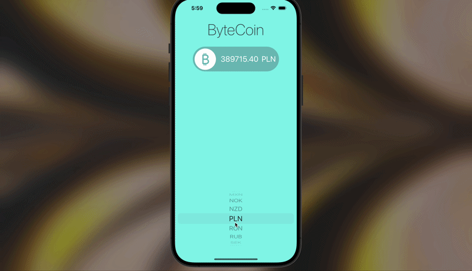

# ByteCoin — Bitcoin Price Tracker



An iOS app that displays live Bitcoin prices in multiple globally traded 
currencies. Built in Swift as a practice project for working with REST APIs, 
asynchronous network requests, and JSON parsing on iOS.


## Demo

[Watch the demo video](https://drive.google.com/file/d/1mdgwNdxdcsZQDiOLAgnX38P8dyhJzNBE/view?usp=sharing)

## Overview

ByteCoin fetches real-time Bitcoin prices from the [CoinAPI](https://www.coinapi.io/) 
cryptocurrency data service and displays them in the user's currency of choice. 
The goal was to practice the core skills behind any networked iOS app: making 
async HTTP requests, decoding JSON into Swift models, and updating the UI on 
the main thread.

## Features

- **Live price updates** — Fetches current Bitcoin prices on demand
- **Multi-currency support** — 21 global currencies including USD, EUR, GBP, JPY, BRL, CNY, INR, ZAR
- **UI** — UIPickerView for currency selection with instant price refresh
- **MVC architecture** — separation of model, view, and controller logic

## Tech Stack

- **Swift** — Core language
- **UIKit** — User interface framework
- **URLSession** — Native HTTP networking
- **Codable / JSONDecoder** — Type-safe JSON parsing
- **CoinAPI** — Real-time cryptocurrency price data ([rest.coinapi.io](https://www.coinapi.io/))

## How It Works

When the user selects a currency from the `UIPickerView`, the app constructs 
a URL for the CoinAPI exchange rate endpoint, sends an asynchronous GET 
request via `URLSession`, decodes the JSON response into a `CoinData` struct 
using `Codable`, then transforms it into a `CoinModel` for the UI layer 
before updating the price label on the main thread.

Key concepts demonstrated:

- Building URLs dynamically from user input
- Handling network responses on background threads with completion handlers
- Dispatching UI updates back to the main thread with `DispatchQueue.main.async`
- Custom delegate pattern (`CoinManagerDelegate` protocol) to decouple the networking layer from the view controller
- Separating the API data model (`CoinData: Codable`) from the view model (`CoinModel`)
- Computed properties for view-ready formatting (`rateString` formats the raw `Double` as a 2-decimal string)
- Error handling at the data layer via delegate callbacks

## Project Structure

```
ByteCoin/
├── Controller/
│   └── ViewController.swift     #Main view controller, picker delegate, delegate implementation
├── Model/
│   ├── CoinManager.swift        #API requests, JSON decoding, CoinManagerDelegate protocol
│   └── CoinData.swift           #Codable response model + view-layer CoinModel
├── View/
│   └── Base.lproj/              #Storyboard with picker and price label
├── Assets.xcassets/             #App icons and color assets
├── AppDelegate.swift
├── SceneDelegate.swift
├── Info.plist
└── ByteCoin.xcodeproj.zip
```

## Running the App

**Prerequisites:** Xcode 14+, iOS 15+ simulator or device, and a free 
[CoinAPI key](https://www.coinapi.io/).

1. Clone the repository
2. Unzip `ByteCoin.xcodeproj.zip` and open `ByteCoin.xcodeproj` in Xcode
3. Add your API key in `CoinManager.swift`:

```swift
   let apiKey = ""
```

4. Select a simulator and press Run

```bash
git clone https://github.com/tislova/bitcoin-price-tracker.git
cd bitcoin-price-tracker
```

## Skills Demonstrated

- **Networking with URLSession** — Configuring requests, handling responses, managing completion handlers
- **JSON parsing with Codable** — Building type-safe Swift models from API responses
- **Delegate pattern** — Designed a custom `CoinManagerDelegate` protocol to communicate between networking and UI layers (the same pattern used by Apple's own frameworks)
- **Data layer separation** — Decoupled the API response model (`CoinData`) from the view-ready model (`CoinModel`) for cleaner architecture
- **Asynchronous programming** — Threading awareness, dispatching UI updates to main thread
- **MVC architecture** — Separation of model, view, and controller responsibilities
- **iOS UI design** — UIPickerView with data source and delegate methods, storyboard layout
- **Working with REST APIs** — Constructing URLs with query parameters, authenticated requests, error handling

## What I'd Add With More Time

- Store the API key securely (Keychain or a gitignored config file)
- Surface errors in the UI instead of just printing them to console
- Swap UIKit for SwiftUI to practice the modern iOS framework
- Add a price history chart using Swift Charts
- Implement price alerts with local notifications
- Cache the last fetched price for offline viewing
- Write unit tests for the JSON decoding and API layer (using `XCTest`)
- Replace the bundled `.xcodeproj.zip` with the unzipped project for cloning
